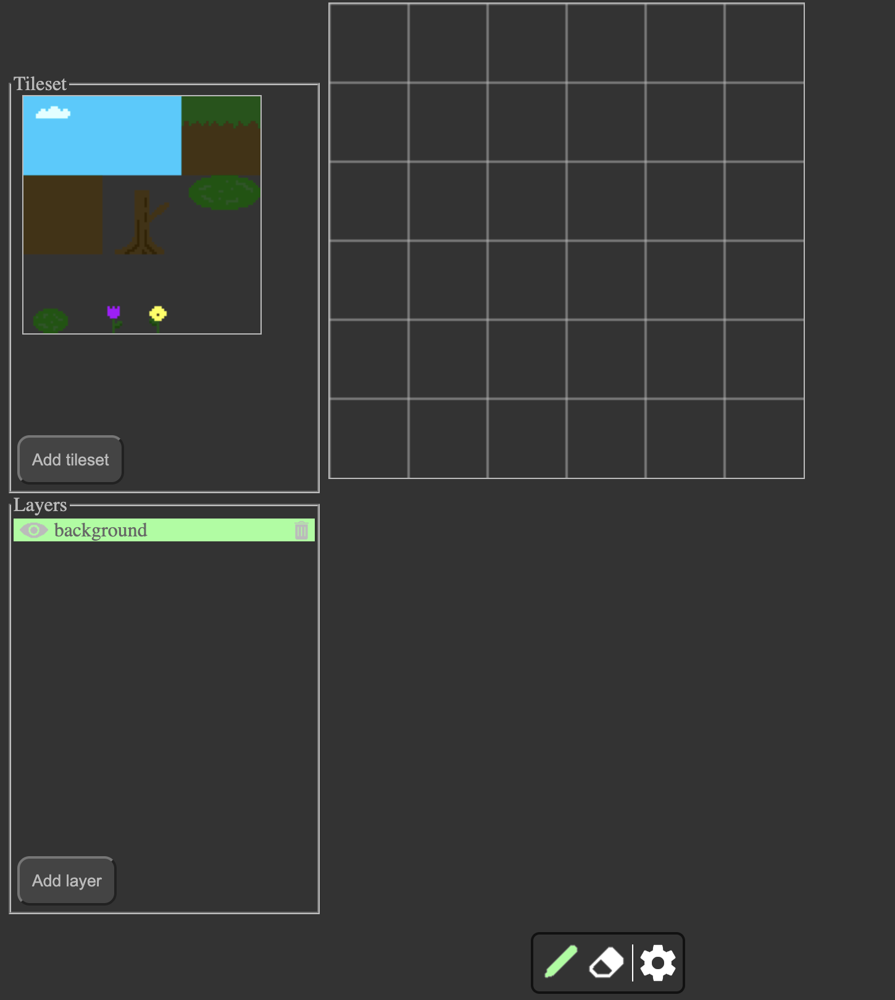
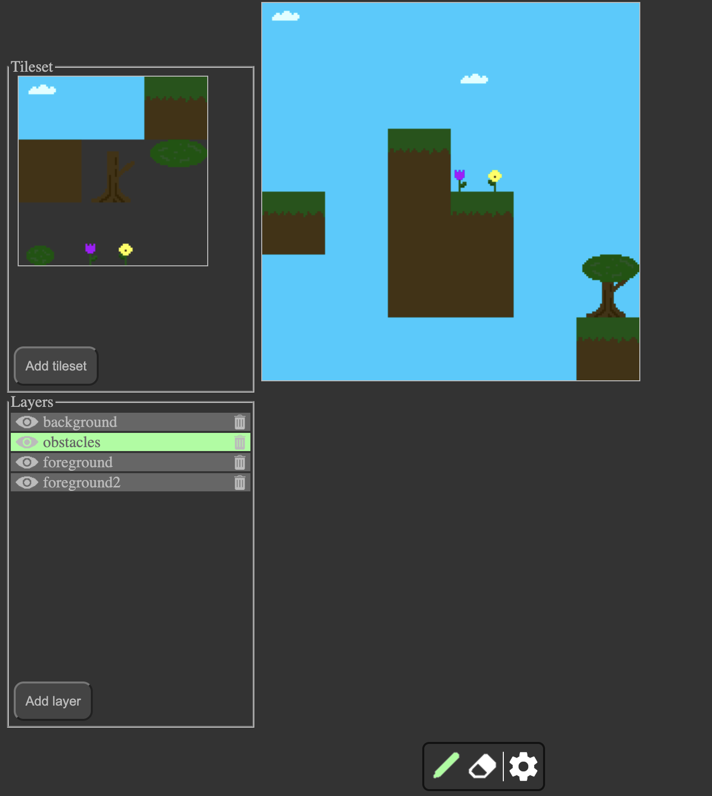

# Tile Editor

This project is intended to fill a need for a high-quality tile editor that can be used without requiring a download. As such, it is designed to run in any modern browser and has a lightweight feature set. Data exports are intended to be compatible with Tiled's format.

## Installation

The latest version of the tile editor can be used without local installation [here](https://web.engr.oregonstate.edu/~bairdn/tile_editor).

This project can **not** be run directly after being downloaded because it uses ECMAScript features like `import`/ `export` that require a web server. One simple solution if you would like to run this code yourself is to use an IDE's preview feature. Microsoft's [Live Preview](https://marketplace.visualstudio.com/items?itemName=ms-vscode.live-server) extension for VS Code is a good example of this option. Alternatively, if you are running a web server, you can place this entire Git repository inside the directory you serve content from.

## Usage
Once you have access to the tile editor, usage is fairly straightforward:

1. Start by adding a tileset.
    1. Presss `[Add tileset]`.
    2. Upload the spritesheet you would like to use.
    3. Enter the dimensions of the tiles in pixels.
2. Add layers to the scene.
    1. Press `[Add layer]`.
    2. Enter the name of the layer.
3. Select a layer to draw on. The selected layer will be highlighted green.
4. Select a tile from the tileset image to add to the scene.
5. Use the pen tool to draw your pattern in the scene.
    - Only the selected layer will be modified.
    - You can use the eraser tool to undo any mistakes.
        - You can use the <kbd>E</kbd> key to easily select the eraser.
        - You can use the <kbd>P</kbd> key to easily select the pen.

## Features

This tile editor is intended to be a lightweight solution for creating simple tile maps. It is not intended for large-scale use: a downloaded app would be better-suited for providing advanced functionality. This tile editor's features include:

- Ability to draw or erase single tiles
- Ability to upload a single tileset for creating a tile map
- Ability to add as many map layers as needed
    - Ability to show/ hide individual layers
    - Ability to remove layers
- Ability to export tilemap
    - Tileset image included (Base64 encoded)
- Ability to re-import a tilemap for updates
- Ability to resize the map as needed

## Coming Soon

More features will be added to the tile editor as time allows. Currently planned are: 

- Layer reordering for easily changing how layers overlap
- A bucket tool for instantaneously adding a given tile across a swath of the scene
- Undo/ redo buttons for fixing larger mistakes

If there are other changes you would like to see, please feel free to submit an issue explaining the feature.

## Screenshots

